  <picture>
    <source media="(prefers-color-scheme: dark)" srcset="profile-banner/assets/dark-v2.svg">
    <source media="(prefers-color-scheme: light)" srcset="profile-banner/assets/light-v2.svg">
    
  </picture>

<h1 align="center">Hi, I'm Eshwar 👋</h1>
<h3 align="center">AI/ML Engineer</h3>

  

---

### 🚀 About Me

- 💼 Working on AI-integrated data pipelines and cloud-based ML systems (GCP / Vertex AI)
- 🔬 Interested in applied ML, generative models, and NLP
- 🎯 Focused on building toward multimodal AI — combining vision and language for real-world applications
- 🕶️ Building in stealth — founder and developer
- 🌱 Currently exploring agentic AI workflows and LLM tooling

---

### 💻 Languages & Tools

---

<i>Thanks for stopping by! Feel free to connect on LinkedIn.</i>

